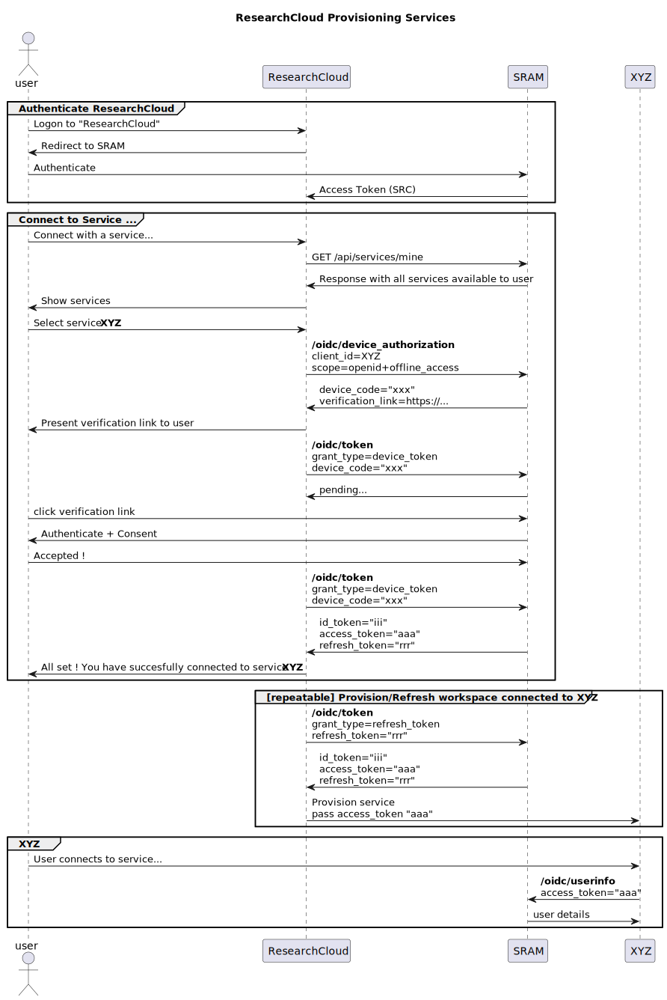
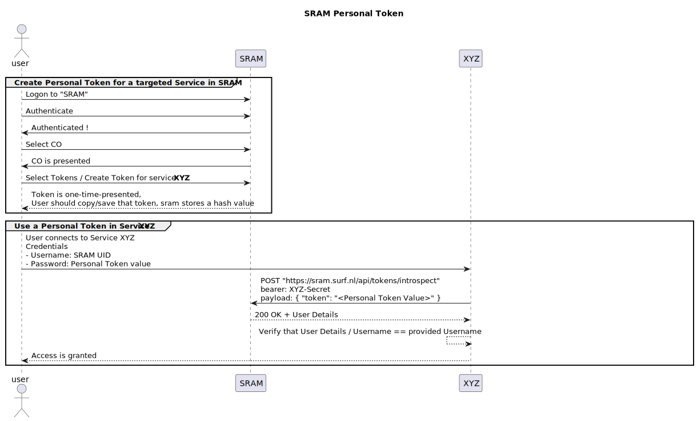

# ResearchCloud Provisioning Flow

<!---
@startuml assets/ResearchCloud

title "ResearchCloud Provisioning Services"

actor user
participant SRC as "ResearchCloud"
participant SRAM

group Authenticate ResearchCloud
user -> SRC: Logon to "ResearchCloud"
user <- SRC: Redirect to SRAM
user -> SRAM: Authenticate
SRC <- SRAM: Access Token (SRC)
end

group Connect to Service ...
user -> SRC: Connect with a service...
SRC -> SRAM: GET /api/services/mine
SRC <- SRAM: Response with all services available to user
user <- SRC: Show services
user -> SRC: Select service **XYZ**
SRC -> SRAM: **/oidc/device_authorization**\nclient_id=XYZ\nscope=openid+offline_access
SRC <- SRAM: device_code="xxx"\nverification_link=https://...
user <- SRC: Present verification link to user
SRC -> SRAM: **/oidc/token**\ngrant_type=device_token\ndevice_code="xxx"
SRC <- SRAM: pending...
user -> SRAM: click verification link
user <- SRAM: Authenticate + Consent
user -> SRAM: Accepted !
SRC -> SRAM: **/oidc/token**\ngrant_type=device_token\ndevice_code="xxx"
SRC <- SRAM: id_token="iii"\naccess_token="aaa"\nrefresh_token="rrr"
user <- SRC: All set ! You have succesfully connected to service **XYZ**
end

group [repeatable] Provision/Refresh workspace connected to XYZ
SRC -> SRAM: **/oidc/token**\ngrant_type=refresh_token\nrefresh_token="rrr"
SRC <- SRAM: id_token="iii"\naccess_token="aaa"\nrefresh_token="rrr"
SRC -> XYZ: Provision service\npass access_token "aaa"
end

group XYZ
user -> XYZ: User connects to service...
XYZ -> SRAM: **/oidc/userinfo**\naccess_token="aaa"
XYZ <- SRAM: user details
end

@enduml
-->



# SRAM Personal Token flow

<!---
@startuml assets/SRAM

title "SRAM Personal Token"

actor user
participant SRAM

group Create Personal Token for a targeted Service in SRAM
user -> SRAM: Logon to "SRAM"
user -> SRAM: Authenticate
user <- SRAM: Authenticated !
user -> SRAM: Select CO
user <- SRAM: CO is presented
user -> SRAM: Select Tokens / Create Token for service **XYZ**
user <-- SRAM: Token is one-time-presented, \nUser should copy/save that token, sram stores a hash value
end

group Use a Personal Token in Service **XYZ**
user -> XYZ: User connects to Service XYZ\nCredentials\n- Username: SRAM UID\n- Password: Personal Token value
XYZ -> SRAM: POST "https://sram.surf.nl/api/tokens/introspect"\nbearer: XYZ-Secret\npayload: { "token": "<Personal Token Value>" }
XYZ <-- SRAM: 200 OK + User Details
XYZ <-- XYZ: Verify that User Details / Username == provided Username
user <-- XYZ: Access is granted
end

@enduml
-->



## Note for contribution

Please update diagram before commit & push to repostitory:

```shell
plantuml -tsvg README.md
```
